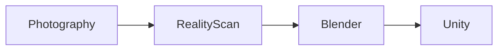

# Photogrammetry Model Creation
UCF Institute for Simulation & Training (IST) | METIL Sim Jam Internship Project #5

### Team: Gavin Heaver, Sebastian Noel, Stevin George

### Project Description:
Use RealityScan to create riggable 3D models with high detail for Unity developed VR applications.

### Pipeline:

Taking many photos of objects from different angles to construct a 3D model in RealityScan, then rigging the model for basic functionality, and finally importing that model into Unity for use in VR applications.

### Documentation:
Access the Documentation: [Project Documentation PDF](Documentation/Photogrammetry_Model_Creation_Documentation.pdf)
