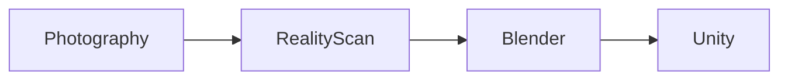

# Photogrammetry Model Creation
UCF Institute for Simulation & Training (IST) | METIL Sim Jam Internship Project #5
### Team: Gavin Heaver, Sebastian Noel, Stevin George

### Project Description:
A repeatable workflow for turning ordinary photographs into textured, riggable 3D models for use in Unity-based VR applications. Using RealityScan as the core photogrammetry tool, the project captures real objects, spaces, and people as sets of photos and rebuilds them as 3D models, with an emphasis on keeping the process accessible and the final assets light enough to run in real time.

### Pipeline:

Each stage hands its output to the next:
- **Photography (Gavin):** capture many overlapping photos of the subject from different angles under controlled, even lighting.
- **RealityScan (Sebastian):** align the photos and reconstruct an initial textured, colorized 3D model.
- **Blender (Stevin):** clean up the raw scan, reduce its polygon count, and rig it when movement is needed.
- **Unity (Stevin):** import the finished model into the engine for use in VR and simulation.

### Documentation:
The full process is written up as a research-style, step-by-step guide that walks through each stage of the pipeline, including the reasoning behind key steps and common pitfalls to avoid.

Access the documentation: [Project Documentation PDF](Documentation/Photogrammetry_Model_Creation_Documentation.pdf)

Access the [YouTube playlist](https://youtube.com/playlist?list=PLOHxtDnf4iDw&si=HVfyegkEJwIFWiok), containing a long-form video of the full pipeline (17 mins) as well as short-form (< 1 min) videos of each major step.
